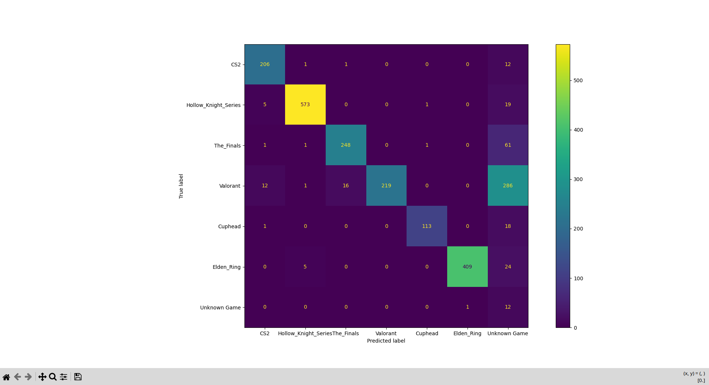

# AI Game Detector

Detects which video game is being played in a video clip using AI-powered image embeddings. Drop in a clip or a screenshot, get the game name.

Currently supports **CS2, Elden Ring, Hollow Knight Series (Hollow Knight and HK Silksong), Apex Legends, Valorant, Cuphead and The Finals**, with pre-built embeddings shipped directly in the repo.

---

## How It Works

The detector uses **OpenCLIP (ViT-B-32)** to convert images into semantic embeddings — vector representations that capture visual meaning. These are compared against a library of reference screenshots to find the closest match.

### Detection Flow

```
Video Clip / Screenshot
    │
    ▼
Extract a frame every 2 seconds           (video.py)        [Video only]
    │
    ▼
For each frame:
  → Generate embedding via OpenCLIP       (embeddings.py)
  → Compare against reference library
  → Pick best game for that frame         (detector.py)
    │
    ▼
Majority vote across all frames           (main.py)         [Video only]
    │
    ▼
Final Prediction: "Game Name"
```

### Two-Level Voting (Video)

Detection runs at two levels for robustness:

- **Frame level** (`detector.py`) — For each frame, the top 5 most similar reference images are found. Similarity scores are accumulated per game and the highest-scoring game wins that frame.
- **Video level** (`main.py`) — Each frame casts one vote. The game with the most frame-level wins is the final prediction.

This means a single ambiguous frame (menu screen, cutscene, black screen) won't throw off the result — it gets outvoted by consistent gameplay frames.

### Embedding Cache

Pre-built embeddings for all supported games are shipped in `cachedEmbeddings/refEmbed.pkl`. The app loads this automatically on startup — no build step needed.

---

## Project Structure

```
.
├── app/
│   ├── main.py                 # CLI entry point + shared detectVideo / detectFrame functions
│   ├── detector.py             # Frame-level game detection
│   ├── embeddings.py           # OpenCLIP model + embedding functions
│   ├── video.py                # Video frame extraction
│		├── evaluate.py		          # Test model performace with testing directory containing folders (Game Names) with their screenshots or pictures
│   └── utils.py                # Embedding cache helpers + shared detection wrappers
├── backend/
│   ├── main.py                 # FastAPI server
│   └──db/
│      ├── db.py                # SQLite database helpers (init, save, get, getAll)
│      └── models.py            # SQLModel table definitions (PredResults)
├── cachedEmbeddings/
│   └── refEmbed.pkl             # Pre-built embeddings (shipped with repo)
├── data
│		└── extractedFrames/         # Auto-generated during detection. Contains cli detection and temporarily the backend before they are deleted
│   		└── save/                # Persistent influential frames served to the frontend (The server auto delete after 2 hours)
└── requirements.txt
```

---

## Model Performance

Evaluated on a held-out test set of frames across all supported games, plus a negative set of frames from unsupported games to test rejection ability.

### Results

**Overall Accuracy: 79.22%** | **Unknown Rate: 19.23%** | **False Positive Rate: 7.69%**

| Game | Precision | Recall | F1 |
|---|---|---|---|
| CS2 | 0.92 | 0.94 | 0.93 |
| Hollow Knight Series | 0.99 | 0.96 | 0.97 |
| The Finals | 0.94 | 0.79 | 0.86 |
| Valorant | 1.00 | 0.41 | 0.58 |
| Cuphead | 0.98 | 0.86 | 0.91 |
| Elden Ring | 1.00 | 0.93 | 0.96 |

### Confusion Matrix



### Notes

- **Apex Legends** hasn't been tested yet
- **Valorant** has perfect precision (1.00) but low recall (0.41) — the model only predicts Valorant when highly confident. This is due to limited map coverage in the reference library and will improve with more diverse reference screenshots.
- **The Finals** unknown rate is similarly caused by missing map/mode coverage in the reference library.
- **False positive rate** measures how often frames from unsupported games are incorrectly classified as a known game. At 7.69% the rejection threshold is working well.
- Hollow Knight and Hollow Knight: Silksong are treated as a single class (`Hollow_Knight_Series`) due to near-identical visual styles shared between the two games.
- The **unknown rate** is largely driven by Valorant — fix Valorant reference coverage and overall accuracy is expected to exceed 85%.

---

## Setup

**1. Clone the repo and create a virtual environment**

```bash
git clone <repo-url>
cd aipro
python -m venv myenv
source myenv/bin/activate       # Windows: myenv\Scripts\activate
```

**2. Install Python dependencies**

```bash
pip install -r requirements.txt
```

**3. (Optional) Build your own reference embeddings**

If you want to add your own games, create a `referenceGames/` folder at the project root and populate it with screenshots:

```
referenceGames/
└── Your_Game/
    ├── screenshot1.png
    ├── screenshot2.png
    └── ...
```

Then delete `cachedEmbeddings/refEmbed.pkl` — new embeddings will be generated automatically the next time `main.py` runs.

More screenshots per game = better accuracy. Aim for at least 10–20 varied screenshots covering different scenes, HUDs, and gameplay moments.

---

## Usage — CLI

Run from inside the `app/` directory:

```bash
cd app
python main.py
```

You'll be prompted to enter a path to a video or image:

```
=== AI Game Detector ===

Enter video path (or q to quit): ../videoClips/Valorant.mp4

Extracting frames...
Selected Duration: 118.0
Extraction Complete

Detected Game: Valorant

Confidence Breakdown:
Valorant: 100.00%

Most Influential Frames from the Clip:
../extractedFrames/Valorant/small/frame_0003_small.jpg
../extractedFrames/Valorant/small/frame_0010_small.jpg
../extractedFrames/Valorant/small/frame_0021_small.jpg
```

- Videos longer than **3 minutes** are automatically capped at the first 3 minutes.
- Start and end times can be customised via command line arguments:
  ```bash
  python main.py <video_path> <startTime> <endTime>
  # e.g. python main.py ../videoClips/Valorant.mp4 00:30 02:00
  ```
- If no frame clears the similarity threshold, the result is reported as **Unknown Game**.
- Enter `q` to quit.

---

## Usage — Backend (FastAPI)

Run from inside the `backend/` directory:

```bash
cd backend
uvicorn main:app --reload
```

The API will be available at `http://localhost:8000`. Interactive docs at `http://localhost:8000/docs`.

### Endpoints

#### `POST /api/upload/clip`

Detect the game in a video clip.

**Form fields:**

| Field | Type | Required | Default | Description |
|---|---|---|---|---|
| `file` | File | Yes | — | Video file (.mp4, .mov, .avi) |
| `startTime` | String | No | `00:00` | Start time in MM:SS format |
| `endTime` | String | No | None | End time in MM:SS format |

**Response:**

```json
{
  "id": "98a0683c-9ad5-40d9-bbb4-b6fe1d5d7c70"
}
```

Detection result is saved to the database. Use `GET /api/results/{id}` to retrieve it.

---

#### `POST /api/upload/frame`

Detect the game in a single screenshot.

**Form fields:**

| Field | Type | Required | Description |
|---|---|---|---|
| `file` | File | Yes | Image file (.png, .jpg, .jpeg) |

**Response:**

```json
{
  "prediction": "Valorant",
  "confidence": 0.91
}
```

---

#### `GET /api/results/{id}`

Retrieve a stored detection result by ID.

**Response:**

```json
{
  "id": "98a0683c-9ad5-40d9-bbb4-b6fe1d5d7c70",
  "clip_name": "Valorant.mp4",
  "prediction": "Valorant",
  "confidences": [["Valorant", 100.0]],
  "frames": [
    "/api/frames/98a0683c-.../frame_0003_medium.jpg",
    "/api/frames/98a0683c-.../frame_0010_medium.jpg",
    "/api/frames/98a0683c-.../frame_0028_medium.jpg"
  ],
  "time_taken": 11.4,
  "created_datetime": "2026-05-24T14:11:15"
}
```

---

#### `GET /api/results/all`

Retrieve all stored detection results, sorted by most recent.

---

#### `GET /api/frames/{id}/{filename}`

Retrieve an extracted frame image by detection ID and filename. Used by the frontend to display influential frames. Frames are cached on the server for 2 hours before cleanup.

---

## Requirements

- Python 3.12
- Node.js 18+
- torch
- open-clip-torch
- opencv-python
- Pillow
- fastapi
- uvicorn
- python-multipart
- sqlmodel
- scikit-learn
- matplotlib

Install Python dependencies:

```bash
pip install -r requirements.txt
```

Install frontend dependencies:

```bash
cd frontend && npm install
```

---

## Future Plans

- [x] Support for single image/screenshot detection
- [x] Confidence score display in output
- [x] Results page with confidence breakdown and frame viewer
- [x] Detection history page
- [ ] Deduplication — reuse results for previously seen clips
- [ ] Event detection within clips (kills, deaths, aces, explosions, etc.)
- [ ] Expand shipped reference library with more games
